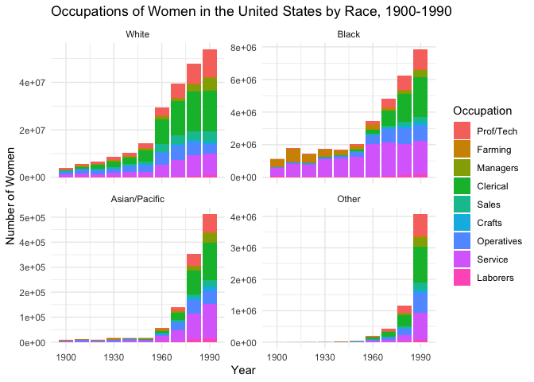

Women Occupation
================
Stuti Goyal

## Including Code

You can include R code in the document as follows:

``` r
library(readxl)
library(tidyverse)
library(ggplot2)
library(dplyr)
```

``` r
ipums <- ipums %>% filter(YEAR > 1950 | !STATEFIP %in% c(2, 15))
ipums %>% filter(YEAR < 1960 & STATEFIP %in% c(2, 15))
```

    ## # A tibble: 0 × 11
    ## # … with 11 variables: YEAR <dbl>, STATEFIP <dbl>, PERWT <dbl>, RELATE <dbl>,
    ## #   RELATED <dbl>, SEX <dbl>, AGE <dbl>, MARST <dbl>, RACE <dbl>, RACED <dbl>,
    ## #   OCC1950 <dbl>

``` r
women <- ipums %>% filter(SEX==2 & AGE %in% 15:64) %>%
                   mutate(OCCUP = OCC1950 %/% 100 + 1) %>% 
                   mutate(OCCUP = ifelse(OCCUP == 9, 2,
                                  ifelse(OCC1950 %in% 910:979, 9, OCCUP))) %>%
                   mutate(OCCUP = factor(OCCUP, labels=c('Prof/Tech','Farming','Managers','Clerical',
                                       'Sales','Crafts','Operatives','Service','Laborers','None'))) %>% 
                   mutate(RACEF = ifelse(RACE == 1, 1,
                                      ifelse(RACE == 2, 2,
                                      ifelse(RACE == 3, 3,4)))) %>% 
                   mutate(RACEF=factor(RACEF,labels=c('White','Black','Asian/Pacific','Other')))
```

## Including Plots

You can also embed plots, for example:

The following graph shows us the distribution of occupations of women
faceted by the race.

``` r
women %>% filter(OCCUP != 'None') %>% group_by(YEAR, OCCUP, RACEF) %>% count(wt=PERWT) %>% 
          ggplot(aes(YEAR, n, fill=OCCUP)) + 
          geom_col() + 
          facet_wrap(vars(RACEF), scales='free_y') +
          scale_x_continuous(breaks=c(1900,1930,1960,1990)) + 
          theme_minimal() +
          labs(x='Year', y='Number of Women', fill='Occupation', title='Occupations of Women in the United States by Race, 1900-1990')
```

<!-- -->
